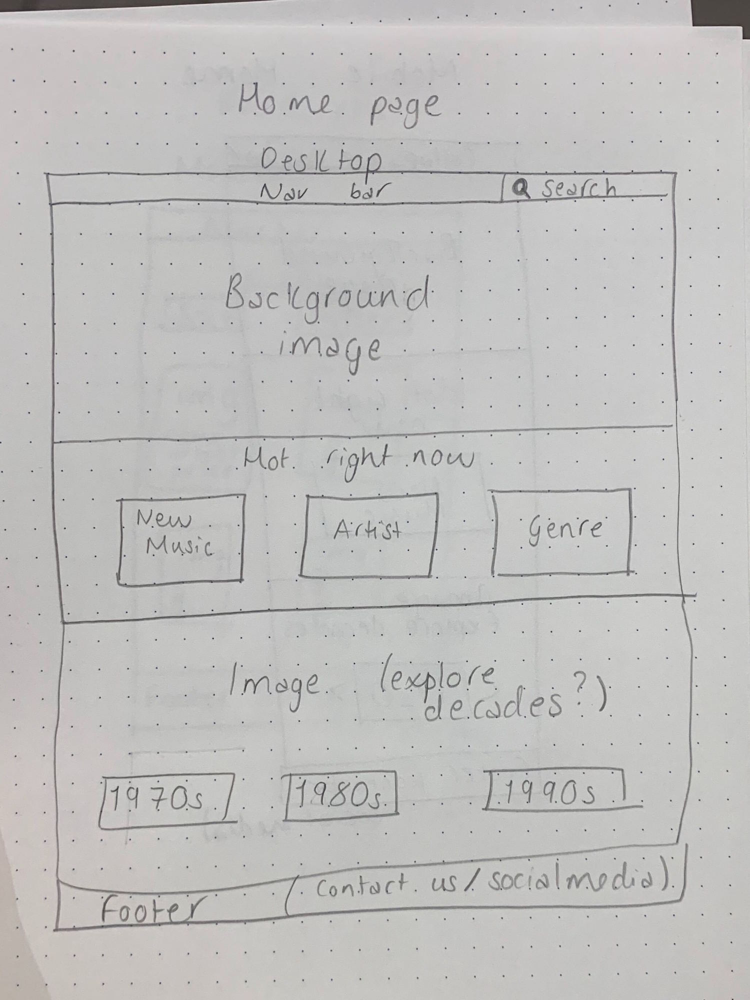
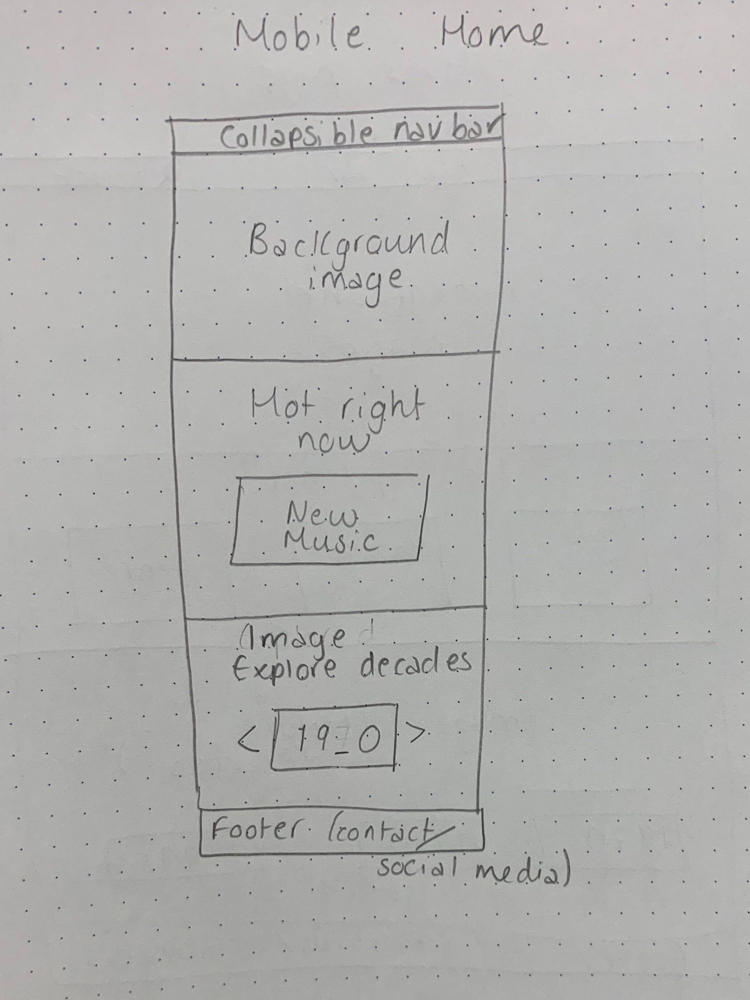
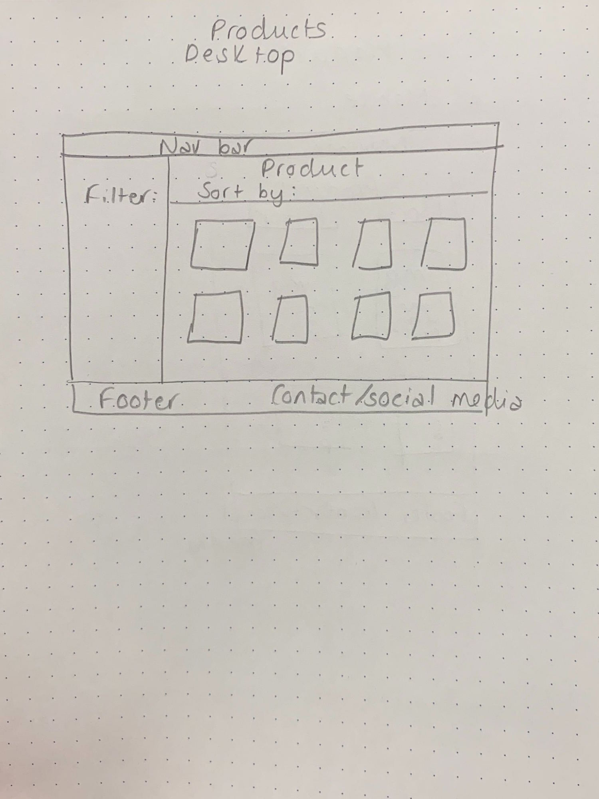
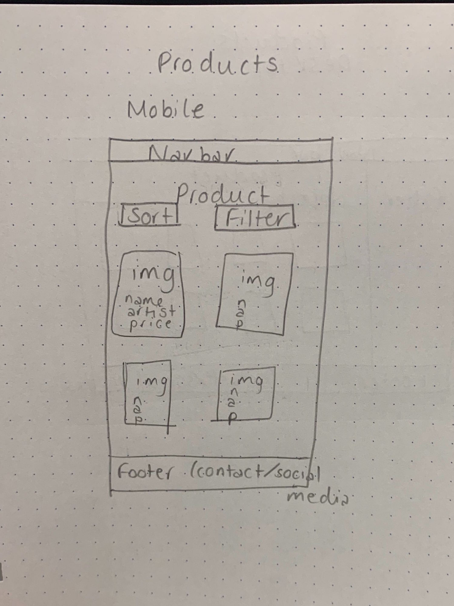
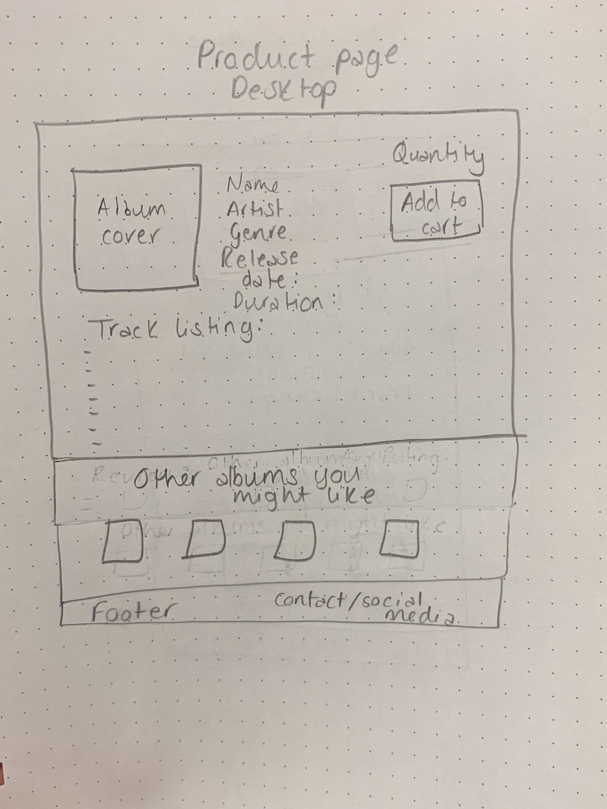
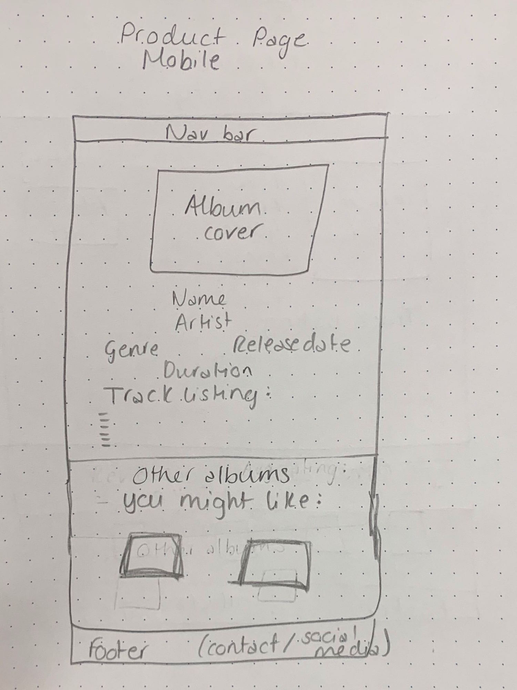
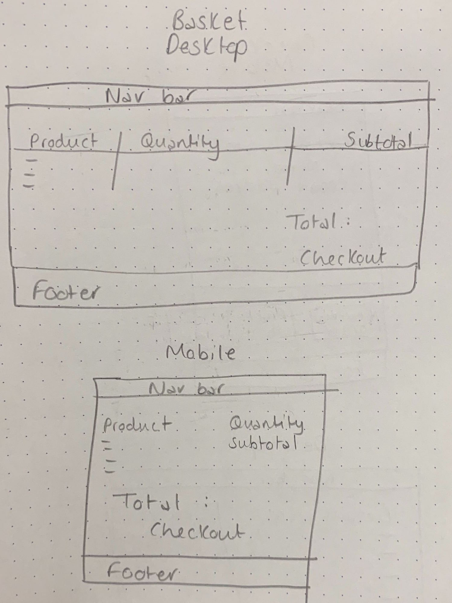
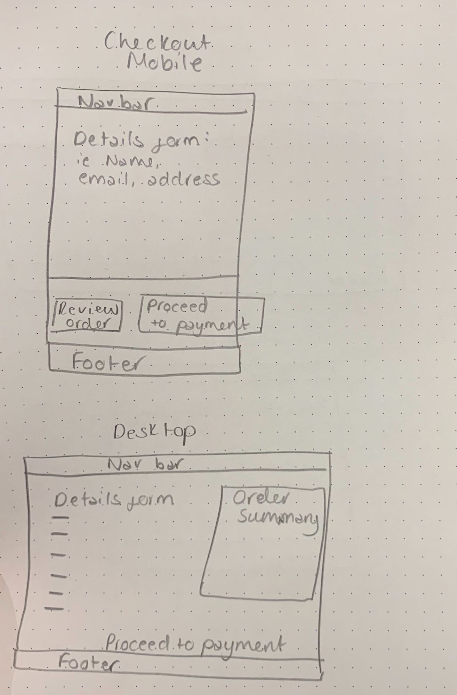

# Full Stack Framewords with Django Milestone Project - MC Records

[](https://travis-ci.org/arcorco/mc-records-ecommerce-milestone)

### Project Overview

The purpose of this project is for users to purchase CDs from an e-commerce store. Users can browse the website to see CDs from different artists. They can filter CDs by artist, genre, release decade and price to view the products best suited to them. Furthermore, the users can create an account on the website. This allows them to purchase items from the store as a purchase can only be made by someone with an account. Logged in users can also then view their details and their previous purchases from their profile page to keep track of their orders. A user with or without and account can however explore the products on the website and their details. The products, users and orders are all stored in a Heroku PostgreSQL database. 

### UX

For the project I drew wireframes out on paper beforehand. Here are the images of the wireframes.









- As a user who has a specific album in mind I would like to purchase, I can use the search bar to search for the album or the artist I am looking for. Furthermore, I can view specific details about the album such as its release date and the track listing of the album.
- As a user looking to explore new music, I can view different areas of the home page such as "Hot New Music" which shows the most recently release ablums on the webiste, and "Artist Spotlight" which shows a selection of a particular artists albums.
- As a user who likes a particular genre of music, I could view all products and filter them by the genre I enjoy to find new artists with a similar style to what I currently listen to. Similarly, if I enjoy music from the 1980s, for example, I can view all albums that were released in the 1980s from to home page, or by filtering all of the products by decade on the products page.
- As a user who has previously placed orders with the website, I would like to view my previous order to keep track of what I have purchased and how much I have spent. I can view this information from the 'My Orders' section of my profile page.
- As a user looking for a good deal on a purchase, I can filter the products by price range to find an album at a price I would be happy to spend. Furthermore, I know that all orders over £30 have free delivery from the banner at the bottom of the nav bar.

### Website Tutorial and Features

On the MC Records home page, the user can view the nav bar, the "Hot New Music" section, the "Explore the Decades" section, the "Artist Spotlight" section and the footer. The "Hot New Music" section displays the three most recently released albums on the website and if the user clicks any of the album covers, or the "Tell my more..." button, they will be taken to that albums detail page. The "Explore the Decades" section displays 4 images of different decades and if the user clicks any of these images, they will be taken to the decades page to view all albums released in that particular decade. The "Artist Spotlight" section shows a carousel of album covers from a chosen artist and if the user clicks any of the album covers they will be taken to that albums detail page.

The nav bar and the footer can be viewed on any of the urls of the webiste. For the nav bar, the user can navigate to the home page via the MC Records logo or the "Home" text link, they can search for products in the database via the search bar
(the search will take the user to the products page where the products shown are filtered match the search query), they can view all products in the database via the "Shop Now" text link and they can view their cart view clicking on the cart icon in the top right corner (if the user has items in their cart, the number of items in the cart will be shown in a pulsing badge). If the user is no loggen in, they will see the text links "Login" and "Register" which will take them to the Login page and Register page respectively. If the user is logged in, they will see the text links "My Account" and "Logout" which will direct them to their profile page or log them out respectively. For the footer, there is a "Shop now" link which will take the user to the products page, a "Contact us" section and a "Follow us" section with links to social media pages.

On the products page which is accessed via the "Shop Now" link in the nav bar, the user can view all album for sale on the website. They can sort the albums via "Recently added" to show the items most recently added to the database, or "Price: lowest to highest"/"Price: highest to lowest" which sorts the products by price. The user can also filter the products shown by Artist, Genre, Decade and Price range, where multiple choices can be selected for Artist and Genre, one choice can be selected from Decade and and minimum price and maximum price can be selected on the range slider from Price range. To sort and filter the results the user must click the "SORT AND FILTER" button after making their selections. From the product page, the user can add items directly to their cart one at a time, and they can click on a product to view more details about it.

On the product details page, the user can find extra details about the album such as the Genre and Release Date and they can add the album to their cart. The Track Listing of the album is also shown, detailing the number of tracks on the album and the name and length of each track. At the bottom of the page their is a "More music to consider..." section which shows 3 random albums in the database (not the one currently detailed) and the user can click these albums to navigate to their respective product detail page. These albums are randomly chosen everytime and product detail page is loaded.

On the cart page, if their cart is empty the user will be shown text explaining this and a "START SHOPPING" button which takes them to the products page. If their cart has items in it, they will be shown the album cover, album title, album artist and album price. There is also a form filled in with the current quantity which they can amend and a subtotal for each product which shows the album price multiplied by the quantity. The total of all items in the cart is also shown at the bottom of the page and below that a button to "CONTINUE TO CHECKOUT".

To continue to the checkout page, the user must be logged in. The means that for a user to make a purchase on the website they must create an account. On the checkout page, the user will again be able to see their cart details and total, and a delivery price will be added as well to show a final total. There is also a "BACK TO CART" button at the top of the page which the user can click if they would like to go back to their cart and amend their order. The user can input their personal details and card details and click the "SUBMIT PAYMENT" button which will take them to an order confirmation page if the payment was successful, or errors will be thrown if their details aren't valid. The confirmation page will show the user and order summary showing details such as the order number, order date, delivery address, the products they purchased and the total price of their order.

On the users profile page, accessed via the "My Account" link in the nav bar they can view their details (name, email address) and they can change these details via the "CHANGE DETAILS" button, or reset their password via the "RESET PASSWORD" button. The user can also view a summary of all of their orders which shows them an order summary of each of the orders they have made with the same details as shown on the order confirmation pages.

For a user who is not currently logged in, if they navigate to the Login page via the link on the nav bar and they have an account, they can input their account details to login in or request a password reset if they can't remember their password. This password reset link will will take them to a form for them to enter their email address where they will receive an email from the mcrecords.customerservice@gmail.com account with a specific link (generated for their request) for them to change their password. If the user doesn't have an account, they can create an account via the Register link in the nav bar. After logging in or creating and account the user will be taken to their profile page.

### Features To Implement
#### Add A Review/Rating
I would like to implement the ability for a logged in user to leave a review on an album they have bought. They would be able to leave a review and a rating which would show up on the albums details page so other users could see what they thought of the album. An average rating would be added to each product and this would be shown both on the product details page and the shop products page. I would also like to add the section "My Reviews" to the users profile page which shows reviews they have left on albums they have purchased.

#### Contact Form
Currently there is a "Contact us" section in the footer of each page, but this just displays information. I would like to implement a feature where this section could link the user to a form which they could fill out with their enquiry and it would send an email to the mcrecords.customerservice@gmail.com account where the content of the email is the enquiry made.

#### Filter and Sort
I feel the filtering and sorting of the products could be improved. Currently, to sort and filter the products the user must fill out the Sort and Filter forms each time as whenever the "SORT AND FILTER" button is clicked, the products page resets. I would like this feature to instead 'remember' the previous Sort and Filter selections made, so that for example if a user sorts the products by "Price: lowest to highest' and clicks "SORT AND FILTER" to sort the products, then they wish to filter the products they would currently need to select "Price: lowest to highest" from the sort selection again as well as choosing their filter options, but I think it would be much more user friendly if the products would remain sorted and the user did not need to select this sort choice again. 

### Technologies Used

- HTML5
- CSS
- JavaScript
- jQuery v 3.5.1 
- Python v 3.8.1
- django v 1.11.29
- Heroku PostgreSQL was the database chosen to hold the data.
- [Materialize](https://materializecss.com/) was used to build and style the website.
- [noUiSlider](https://refreshless.com/nouislider/) was used for the Price Range filter.
- [Font Awesome](https://fontawesome.com/)
- Google Fonts
- Chrome Developer Tools used for debugging, live-testing, styling and responsiveness.
- [Favicon.io](https://favicon.io/)
- [Travis CI](https://travis-ci.org/)
- [Cloudinary](https://cloudinary.com/)
- [Stripe (Test only)](https://stripe.com/gb)

### Testing

The website was tested extensivley through many different means. All of the forms in the website are validated via django's form validation and HTMl required fields, so for example the user can't add a quantity of a product to the cart that isn't a number between 1 - 25. Furthermore, a user cannot crete an account with an email or username that is in use. I also carried out a lot of manual testing on the website, for example:

1. A user who is not logged in tries to purchase an item
    - After adding some items to their cart the user is directed to the cart page whenever an item is added and clicks the "CONTINUE TO CHECKOUT" button on the cart page. Since the user is not logged in, the should not be able to proceed to the checkout and indeed after clicking "CONTINUE TO CHECKOUT" we are redirected to the login page. If the user then tries to access the checkout by adding "/checkout" to the url, they are again redirected to the login page.

2. A logged in user tries to purchase an item
    - After logging in, the user adds some items to their cart and continues to the checkout page. Try to click the "SUBMIT PAYMENT" button without filling in any information. Error message pops up below the "First name" field stating "Please fill in this field.". Work down the personal details of the form filling in the form one field at a time and each time the "SUBMIT PAYMENT" button is clicked, an error message shows beneath the following field stating that it needs to be filled in. Now fill in the card details with the Stripe test card number '4242424242424242' and 3 random numbers for the Securit code (CVV), but choose an expiry month and year that means the card has already expired, i.e. 02/2019, click "SUBMITE PAYMENT" and an error shows explaining "Your card's expiration year is invalid". Correct the expiration year to a valid one in the future and click "SUBMIT PAYMENT" and we are redirected to the confirmation page for this order.

3. A user makes a purchase less than £30
    - The user is logged in and has added an item to their cart, so their cart total is £9.99. The user then views their cart and clicks "CONTINUE TO CART". Since the total of items in the cart is less than £30, they expect to see a delivery cost of £3.95, which is shown above the Total. The user also expects to see a total price of subtotals plus delivery and indeed the Total shows £13.94 (or £9.99 + £3.95). After filling out valid Payment Details and clicking "SUBMIT PAYMENT" they are taken to the confirmation page which again shows a total of £13.94. Furthermore, if the user views the order in the orders section of their profile page, again they will see a total price of £13.94.

4. A user tries to register an account with an email and username that is already in use
    - The user navigates to the Register page from the nav bar and creates and account with then username "user1" and email "user1@email.com" and are logged in with that account. They then log out and again navigate to the Register page again. They fill out all of the details again with the same username and email and click "REGISTER". The error messages "This email address is already in use. Please use a unique email address." and "This username already exists. Please choose a unique username." are shown beneath the Email address and Username fields respectively. The user changes their email and username to unique ones, but now doesn't fill in matching passwords. Again, they are shown an error message "Passwords must match" beneath the Password Confirmation field. After filling in matching passwords, they successfully create an account.

The responsiveness of the website on different viewport widths was tested throughout with Developer Tools and the element style section was used to make any alterations to the layout before changing my custom.css file. The website has also been tested on Safari, Chrome and Firefox and the deployed version has been tested on MacBook Air and iPhone X.

All HTML and CSS files validated via (https://www.w3.org/).

JavaScript validated via (https://jshint.com/).

### Deployment

This website was deployed to Heroku. I pushed my repository to GitHub, then built an app on Heroku and connected it to GitHub so that any repository pushes to GitHub would automatically build on Heroku. The environment variables used are the same in the deployed version as in the development version, held in an env.py file or as Heroku Config Var. To deploy to Heroku I also included a requirements.txt and a Procfile.

To run the code locally, clone or download the repository and extract all files. Then start a virtual environment and install all packages from the requirements.txt file.
```python
pip install -r requirements.txt
```
In settings.py, add a new SECRET_KEY (or create an env.py file in the top level of the app directory and put the SECRET_KEY in there with `os.environ.setdefault("SECRET_KEY", "your secret key")`). The app uses SQLite3 database if a Postgres DATABASE_URL is not present, but you can set up a Postgres database and put the database url in an env.py file. Then run 
```python
python manage.py makemigrations
python manage.py migrate
python manage.py createsuperuser
python manage.py runserver
```
and open the app on your browser to view it.


### Credits

- The album covers, release date and track listings were from the respective album's Wikipedia pages. 

- The decades images were from https://www.vecteezy.com/free-vector/gradients, https://cdn-media.threadless.com/challenges/90s_mainbanner.jpg, https://pbs.twimg.com/profile_images/464085880982884352/qLaRXz38_400x400.png. 

- [Alpha Coder's](https://alphacoder.xyz/image-upload-with-django-and-cloudinary/) tutorial on "Image upload with Django and Cloudinary" for setting up Cloudinary with my Django app.

- [Vitor Freitas'](https://simpleisbetterthancomplex.com/) tutorials "How to Paginate with Django" for Django pagination on my products and decades pages, and "How to Create a Password Reset View" for help with the password_reset_email.html and password_reset_subject.txt in particular.

- Code Institute, Authentication and Authorisation mini project accounts app, which I created following the Code Institute tutorial and used the accounts app for user login here.